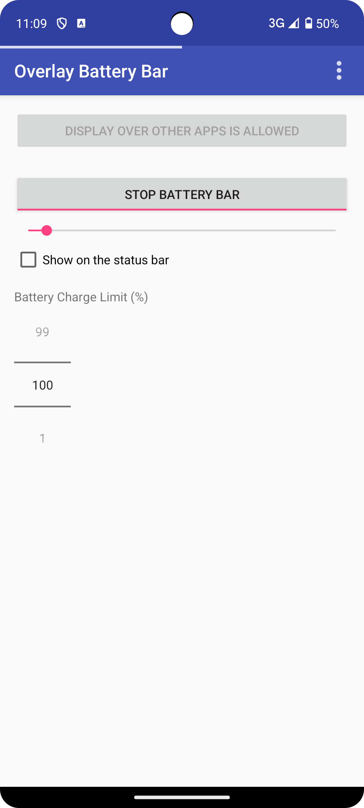
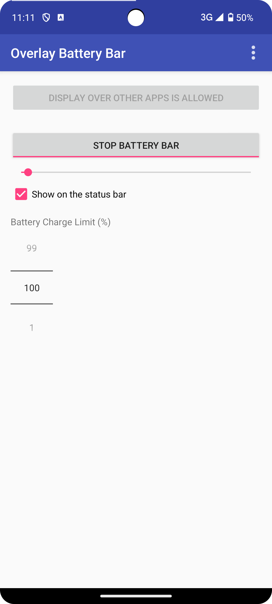

# Android-OverlayBatteryBar 

**Android-OverlayBatteryBar** is an Android application that displays a battery level bar at the top of the screen, overlaying other applications.

 

## Key Features
* **Displays a battery level bar at the top of the screen:** Allows you to visually check the battery level at all times by displaying a bar at the top of the screen.
* **Customizable bar width:** You can adjust the thickness of the bar according to your preference.
* **Option to show the bar on the status bar:**  You can choose to display the bar overlaid on the status bar.
* **Adjustable battery charge limit:** You can set the battery charge limit by percentage.
* **Automatically starts on boot:** The app automatically starts and displays the bar when the device boots.
* **Uses a foreground service:** Ensures the app continues to run even in the background by utilizing a foreground service.
* **Notification for status and easy disabling:** A notification is displayed while the app is running, allowing you to quickly disable the bar display with a tap.
* **Adapts to screen size, rounded corners, and display cutouts:** Automatically adjusts the bar's display position to fit various device screen shapes.
* **Supports Android 5.0 (API level 21) and above:** Compatible with a wide range of Android devices.

## Usage

1.  Install and launch the app.
2.  Grant the "Display over other apps" permission.
3.  Enable the battery bar using the toggle switch.
4.  Customize the battery bar width using the seek bar.
5.  Toggle the "Show on the status bar" option if desired.
6.  Set the battery charge limit using the number picker.

The battery bar will now be displayed at the top of the screen, overlaying other applications. The app will automatically start on boot and continue running in the background.

## Download

https://play.google.com/store/apps/details?id=com.nagopy.android.overlaybatterybar

## License

    Copyright 2017 75py

    Licensed under the Apache License, Version 2.0 (the "License");
    you may not use this file except in compliance with the License.
    You may obtain a copy of the License at

       http://www.apache.org/licenses/LICENSE-2.0

    Unless required by applicable law or agreed to in writing, software
    distributed under the License is distributed on an "AS IS" BASIS,
    WITHOUT WARRANTIES OR CONDITIONS OF ANY KIND, either express or implied.
    See the License for the specific language governing permissions and
    limitations under the License.
