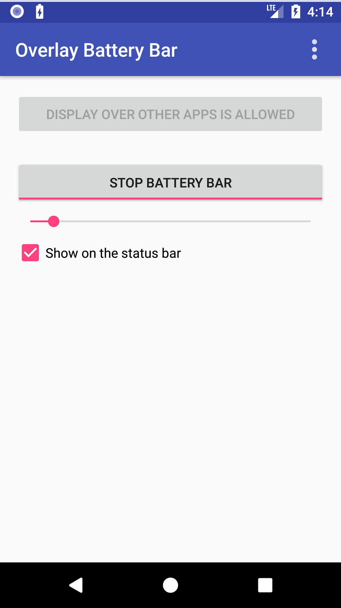

# Android-OverlayBatteryBar   

Show battery percentages by the white bar.  
You can check the remaining battery level during full screen mode such as gaming.

## Download

https://play.google.com/store/apps/details?id=com.nagopy.android.overlaybatterybar

## License

    Copyright 2017 75py

    Licensed under the Apache License, Version 2.0 (the "License");
    you may not use this file except in compliance with the License.
    You may obtain a copy of the License at

       http://www.apache.org/licenses/LICENSE-2.0

    Unless required by applicable law or agreed to in writing, software
    distributed under the License is distributed on an "AS IS" BASIS,
    WITHOUT WARRANTIES OR CONDITIONS OF ANY KIND, either express or implied.
    See the License for the specific language governing permissions and
    limitations under the License.
