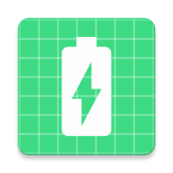
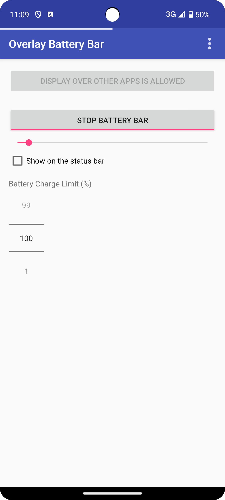
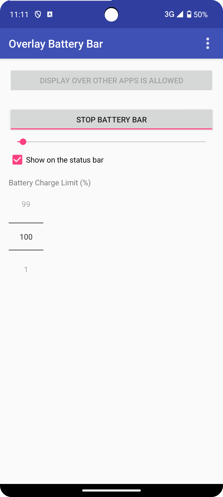

# Android-OverlayBatteryBar 

[English](README.md) | **Русская**

**Android-OverlayBatteryBar** — это Android-приложение, которое отображает индикатор уровня заряда батареи в верхней части экрана, поверх других приложений.

 

## Основные возможности
* **Отображение индикатора заряда батареи в верхней части экрана:** Позволяет визуально проверять уровень заряда в любое время, отображая полосу в верхней части экрана.
* **Настраиваемая ширина полосы:** Вы можете регулировать толщину полосы по своему усмотрению.
* **Отображение полосы на панели состояния:** Можно выбрать отображение полосы поверх панели состояния.
* **Настраиваемый предел заряда батареи:** Можно установить предел заряда батареи в процентах.
* **Автоматический запуск при загрузке устройства:** Приложение автоматически запускается и отображает полосу при включении устройства.
* **Использование foreground-сервиса:** Обеспечивает работу приложения даже в фоновом режиме.
* **Уведомление для управления и быстрого отключения:** Во время работы приложения отображается уведомление, позволяющее быстро отключить отображение полосы одним нажатием.
* **Адаптация под размер экрана, скруглённые углы и вырезы:** Автоматически подстраивает положение полосы под различные формы экранов устройств.
* **Поддержка Android 5.0 (API level 21) и выше:** Совместимо с широким спектром Android-устройств.

## Использование

1. Установите и запустите приложение.
2. Предоставьте разрешение "Отображать поверх других приложений".
3. Включите индикатор заряда с помощью переключателя.
4. Настройте ширину полосы с помощью ползунка.
5. При необходимости включите опцию "Показывать на панели состояния".
6. Установите предел заряда батареи с помощью числового селектора.

Теперь индикатор заряда будет отображаться в верхней части экрана, поверх других приложений. Приложение будет автоматически запускаться при загрузке устройства и продолжать работу в фоновом режиме.

## Скачать

[https://play.google.com/store/apps/details?id=com.nagopy.android.overlaybatterybar](https://play.google.com/store/apps/details?id=com.nagopy.android.overlaybatterybar)

## Лицензия

    Copyright 2017 75py

    Лицензировано по Apache License, Version 2.0 (the "License");
    вы не можете использовать этот файл иначе, чем в соответствии с условиями лицензии.
    Вы можете получить копию лицензии по адресу

       [http://www.apache.org/licenses/LICENSE-2.0](http://www.apache.org/licenses/LICENSE-2.0)

    Если это не требуется действующим законодательством или не согласовано в письменной форме,
    программное обеспечение, распространяемое по лицензии, предоставляется "КАК ЕСТЬ",
    БЕЗ КАКИХ-ЛИБО ГАРАНТИЙ ИЛИ УСЛОВИЙ, явных или подразумеваемых.
    См. текст лицензии для получения конкретной информации о разрешениях и ограничениях.
